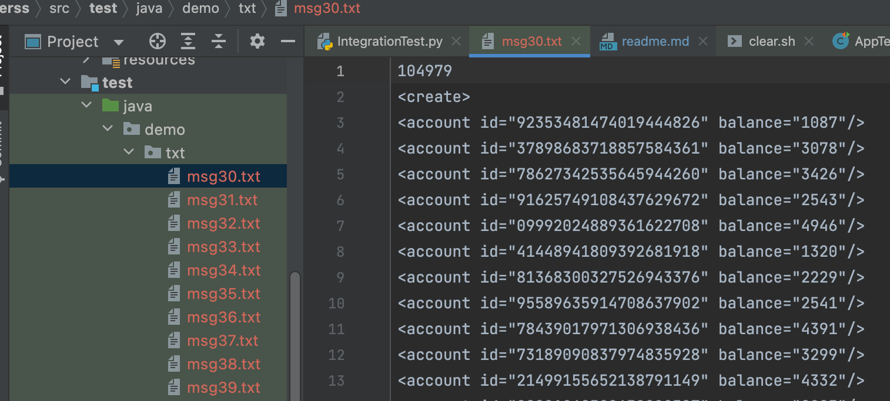

# Engine For Matching Stock
Author
* xz295
* wg83

# 1. Usage
usage: sudo ./run.sh

# 2 Design & Implementation

## 2.1 Introduction to Thread Pool

In the server side, we use `threadPool` to do concurrency control, otherwise, too many requests will cause us Out Of Memory

## 2.2 Object Relational Mapping(ORM)

**Why we choose hibernate?** 

* we are inspired by ECE 651 during which the gradle is the version control tool and hibernate at that time was introducted to interact with the database
* Besides, the interface for it is convenient to use
* Third, the transaction control can help us avoid most of the concurrency issues (check for test scripts)

# 3. Test

Test Directory is under `erss/src/test/java/demo/*`

## 3.1 Correctness Test

By using correctness, we use traditional `Junit` to help us do tests, especially regression test.

Like the picture below

Make sure the basic logic is correct before we do the multi-testing.

## 3.2 Integration Test

The script `IntegrationTest.sh` under test directory is to test in a whole logic. Both create & Transaction part.

We have made it automatically generating requests from seveal files and send them as multi-clients.

This is the sample of how we generate test cases

## 3.3 Performance Test

Please refer to the writeup/report.pdf for details.

# 4 Reference & Acknowledge

1. [Java DOM Parser](https://www.tutorialspoint.com/java_xml/java_dom_parse_document.htm)
2. [PostgreSQL](https://www.tutorialspoint.com/postgresql/postgresql_java.htm)
3. [Transaction For Hibernate](https://www.javatpoint.com/hibernate-transaction-management-example)
4. [Java Socket Programming](https://www.geeksforgeeks.org/establishing-the-two-way-communication-between-server-and-client-in-java/)
5. [Java Socket Programming-2](https://www.cnblogs.com/yiwangzhibujian/p/7107785.html)

6. [ThreadPool Picture](https://www.javamex.com/tutorials/threads/thread_pools.shtml)