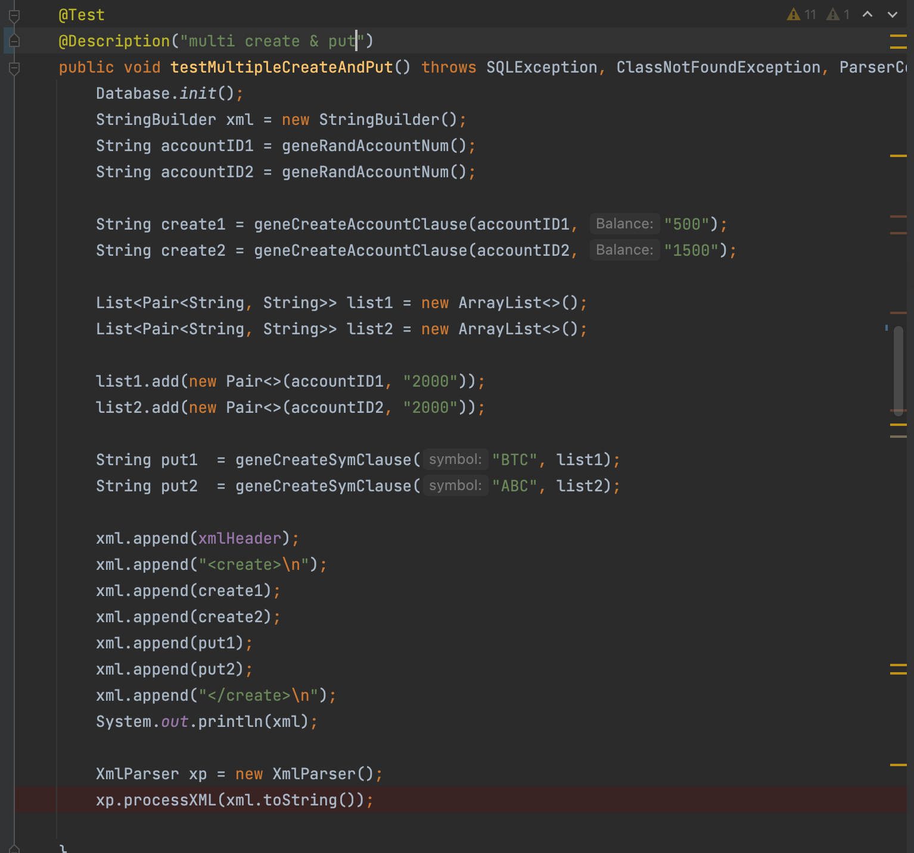

# Engine For Matching Stock
Author
* xz295
* wg83

# 1. Usage
usage: sudo docker compose up --build (for the first time)

# 2 Design & Implementation

## 2.1 Introduction to Thread Pool

In the server side, we use `threadPool` to do concurrency control, otherwise, too many requests will cause us Out Of Memory

## 2.2 Object Relational Mapping(ORM)

![Hibernate (@Hibernate) / Twitter](data:image/jpeg;base64,/9j/4AAQSkZJRgABAQAAAQABAAD/2wCEAAkGBxAPEBAOEhAPDxANEBcTERAQERAQFhUQFREYGBgTFhUYHSggGBolGxMVJzEhJSkrLi4zFyAzODMsNygtLisBCgoKDg0OGxAQGy0mHyUwLS8tKy0tLS0tKy4tLSstLS0rLS0tLS0tLS0rLS0tLS0tLSstKystLS0tLS0rKzcrN//AABEIAOEA4QMBIgACEQEDEQH/xAAcAAEAAgMBAQEAAAAAAAAAAAAABQYDBAcCAQj/xABFEAACAQMABQcKAwYDCQEAAAAAAQIDBBEFEiExQQYTIlFhcYEHFBVCUlORkqHRMjXBFnJzgrLwYnThJDM0Y5Oxs8PSI//EABkBAQEBAQEBAAAAAAAAAAAAAAABAgMEBf/EACARAQEAAgEEAwEAAAAAAAAAAAABAhEhAxIxUQQiQRP/2gAMAwEAAhEDEQA/AO4gAAAAAAAAAAAAAAAAAAAAAAAAAAAAAAAAAAAAAAAAAAAAAAAAAAAAAAAAAAAAAAAAAAAAAAAAAAAAAAAAAAAAAAAAAAAAANLSGlaNu4RqT1ZVM6scNtqO94XejX/aG29uXyS+xm54zzVktSoIr9obb25fJL7D9obb25fJL7E/rh7h21Kgiv2htvbl8kvsbtneQrR14PKzjc1t7mWZ43xTVbAANIAAAAAAAAAAAAAAAAAAAAAAAA+H0AAeKtRRi5SajGKbbe5JLaz2UPynad5umrKD6dZa1XHCnwj/ADP6LtCW6UvlFp6d1dyuU2oweKK6qaez47W+8sFncKrCNSO6S+D4oopM8nL7UnzTfRqPZ2T/ANTl8npd2O55i9PPV5WcAHzXpCV5PX/M1dVvoVdj7Hwf99ZFAuOVxu4lm3SgRPJ2/wCeparfTpbH2rg/76iWPqY5TKbjhZoABpHw+gAAAAAAAAAAAAAAAAAAAAAAGppS/hbUalef4aUcvrb4Jdrew4TpK+ncValeo8zqyy+zqS7EtngXTyqaVm6lOzSlGnGKqye5Tk8pY60sPxfYUI1I55UCeNvUAaRc9E3vPU1L1o9Ga7evxN0qPJ+vKNeEIpy56Shqri29n1Zf/Qdz7p/ND7nzOt0bjlxOHqwz3OUcCR9B3Pun80PuPQdz7p/ND7nH+eXqt7jDou9dCrGpw3SXXF7y+wmpJSTymsp9hSPQdz7p/ND7k7oKtOlq2tbEZtOVJOUW3BY1lsfDK+PYer49yn1sc89XlOAA9bmAAAAAAAAAAAAAAAAAAAAAAAAqvlB0F51bc5BZrWyco43yh60Ppldxx8/RRxvl7oLzS5coLFG4zOGN0ZetD4vK7H2GsaxlFZAN7QmjJ3denbw31JdKXswX4peC/Q0wunkv0FlyvprYswop9frT/ReJ0gwWVrCjThSgtWFOKjFdiM5i11k0AAisderGEZTk1GMIuUpPcopZbOLaV5SVat959BtOnJczF8KcXsi+/bn95lu8p+ndSCsYPpVUpVmuFPOyPi18F2nNDUjGVd+0TpCF1Rp3EH0asc46nxi+1PYbhyzyZ6d5qq7Ob/8AzuHmnnhVxu/mX1S6zqZLNNS7AARQAAAAAAAAAAAAAAAAAAAAAIflToZXttOjsU10qUnwqJbPB7U+8mAB+d6tNwlKEk4yg3GSe9STw0zqvk20FzFDzmaxVuVszvjR4Lx3/AwcpuSlOd9Su5NQt6jzcds47sY9rYn3PrLRHTVslhVIpLZhKX2GXUxnms44VJAjvTlt71fCX2Hpy296vhL7GP6Y+29VImlpfSMLWhUuJ/hpRzjrluUV2ttIx+nLb3q+Evsc78pOnufqQtqbfNU0pt7Upza2eCWfFs1jlMrqVMtyKlpC8ncValeo8zqycn+iXYlheBrgHVxeoTcWpJtOLymt6a3NHbuSWmle20KrxzkehVS4VFx7nv8AE4eWXyf6Xlb3kKaUpQumqc4rbt9WSXY/o2SxrG6dlB8Pph0AAAAAAAAAAAAAAAAAAAAAAAAYbu3jVhKnLdNY/wBSgXVvKlOVOW+Dx39TOilf5VaP1o8/FdKnsl2x6/A8/wAjp903PxvC6VUAHgdgiuUFlzlPXS6dPb3x4r9SVBrDO45biWbmnPwSGm7LmajwuhU2x7Otf31kefXxymU3His1dB0XyX6C/FfzW/MKKfwlP9F4lK0Doqd5cU7eOzXeZS9mmvxS/vrO6WltClThSgtWFOKjFLgksIWtYxlPoBlsAAAAAAAAAAAAAAAAAAAAAAAAPM4ppp7U1hrsPQAoWlrJ0Ksoeq9sH/hZpF20/o/n6fRXTp7Y9vXHxKv6HuPdT+n3PndXpXHLicO2OW40Qb3oe491P6D0Pce6n9Dn2ZemtxDaUs1WpuHrLbB/4kUuSxlPY1vydN9D3Hup/Q0bfkXUq3lOpUpuND8dVPG2UcYj/N+jPZ8bLLH62OPVxl5ia8nGgfN6HnE44q3KT2740vVXjv8AgXA+JH09LIAAAAAAAAAAAAAAAAAAABjo14Ty4TjNLe4yUsfADIDHWrwhjWnGGdi1pKOX2ZPtWtGC1pSjFdcmor4sD2Dw6sdXX1lq4zrZWMdeeowrSFD31L/qQ+4GyD4nnbvya70hRWznqWz/AJkPuBsgx0a8JrMZRmlsbjJSWe9GD0nb5xz9HPVzkPuBtg+Rkmsppp7mtp5VWOdXWjrdWVn4AeweZzSWW0l1vYIyTWU8p8VtA9A8TqxWxySb3JtI+zmorLaS628E2PQMPnNP24fNE9RrRabUotLe008d43BkBh85p+3D5kZYyTWU8p8UNj6ACgAAAAAAAAAAPktz7igeSmtCFC41pRjmst7S9RF/lufccs5A8mra9pVp1oylKnUUY6s3HY454Fnhm+Ur5UK0JwtNWUZYr8Gn6pJ+Uz8un/Ep/wBaKzy45N21lG2lRjKLqVtWWtNy2JZ4lm8pf5dP+JT/AK0U9st3+TS/yH/qK5yf5O6Oq6PhcXGrCbU9apzso4xOST1c43JcCyXf5NL/ACK/8RX+TPI6zurCnXqKcKk1PNSM8Y1ZySeHs3ICS8lsqrtamu5OmqrVFyz+HG3GeGf1IHkjoK0u6t87iKfN13q9Nw3znnc1ncid8mV/VqU69Gc3Up201GlN+y89HPVsT/mIPkjydt76rfOtGUuarvV1ZOO+c87u4J6X3ROibe0pTp261YSbk+m59LVS3t9SRQOQfJy0u7atUrw2wqaqmpyhqx1E+Dxx4nQdFaIo2dGVGipKDcpYk3J6zW3a+5HHrLRU5Wk7yOakKFbVrUsySdPVT1tnDa0/ARau/kvqz/2uipyqUKNRKlJ7VvktnVlKLx2mW9143FatDfRq5b73j4cPEn+S1W2na05W0I06TW2C3xn6yl1vPE1tG01O6vISWYy2NdmTz9ed2o6YcRn0pdRrWUqi3SSyup6yyjc0J/w9H9xFXruVtz9rLLjUWYPxWH8NngT9tc81ZRqezS2fvbl9TGGe8rb+TlbOEJpjWr1a1SP4bZJJ90uHjl+BYqChd28NdZU0tZZa6S37u1EHomvKnRlDzarU57Lc0nhprC4G1yUruPOW8k04vWSlsa4Nf9viZ6dndz+rfDUu9GUo3dKio9CcctZe/pcfBExW0fToUK6px1dam87W90X1mpf/AJhQ/d/+yV0p/uK38OX9JvHGfbhLfCE0Loq3qUYzmuk289Jrc+rJYbalGEYwjsjFYW3OzvK/obQtGtRjUmpOTznEmtzwWGhSUIxgt0Uku5F6M43pMryyAA7sgAAAAAAAAAA+NENyZ5PQsIVIQnOoqstZuaWx4xwJoAQ3KTk9C/VKM5zhzM9daqW14xh5M3KDQ0b2g7ec5QjKUXrRxnovPEkwDSOq6KjK0dnrS1XR5rX2Zxq4z1ZK3Dyd0ktR3d26fGmpJR+GMfQuoG000dEaKo2lNUaMdWKeXxbl1t8WVmfk9pOc5q6uYOpNyag4x2uTfDvLoBs0idAaEVnSnRVWrWU5uWtUeWsxSwuzYY+TnJynY0qlGM5VY1ZZlrqPspY2cNhNALpA6A5MQsalWdKrU5utvoy1XFPOxp78pbO4kbXR0adWpWUm3V3p4wtvA3QSyXyThH6U0VC41dZuLjuccbuo83GiIzowoa8lGnjasZeOv4kkCXDG/i7rzTgopRWxRWF3I0noyPP+cqUlLGHFYw9mPt8DfBbjKm2jW0bGdeFw5NSprCjsw9/3Nm5o68JQbwpxcW12oygdsNoKPJqK2KtVS6k0iYtaPNwjDLlqLGXveOLMoM44Y4+IttoADaAAAAAAAAAAAAAAAAAAAAAAAAAAAAAAAAAAAAAAAAAAAAAAAAAAAAAAAAAAAAAAAAAAAAAAAAAAAAAAAAAAAAAAAAAAAAAAAAAAAAAAAAAAAAAAAAAAAAAAAAAAAAAD/9k=)

**Why we choose hibernate?** 

* we are inspired by ECE 651 during which the gradle is the version control tool and hibernate at that time was introducted to interact with the database
* Besides, the interface for it is convenient to use
* Third, the transaction control can help us avoid most of the concurrency issues (check for test scripts)

# 3. Test

Test Directory is under `erss/src/test/java/demo/*`

## 3.1 Correctness Test

By using correctness, we use traditional `Junit` to help us do tests, especially regression test.

Like the picture below

Make sure the basic logic is correct before we do the multi-testing.

## 3.2 Integration Test

The script `IntegrationTest.sh` under test directory is to test in a whole logic. Both create & Transaction part.

We have made it automatically generating requests from seveal files and send them as multi-clients.

## 3.3 Scalability Test

# 4 Reference & Acknowledge

1. [Java DOM Parser](https://www.tutorialspoint.com/java_xml/java_dom_parse_document.htm)
2. [PostgreSQL](https://www.tutorialspoint.com/postgresql/postgresql_java.htm)
3. [Transaction For Hibernate](https://www.javatpoint.com/hibernate-transaction-management-example)
4. [Java Socket Programming](https://www.geeksforgeeks.org/establishing-the-two-way-communication-between-server-and-client-in-java/)
5. [Java Socket Programming-2](https://www.cnblogs.com/yiwangzhibujian/p/7107785.html)

6. [ThreadPool Picture](https://www.javamex.com/tutorials/threads/thread_pools.shtml)