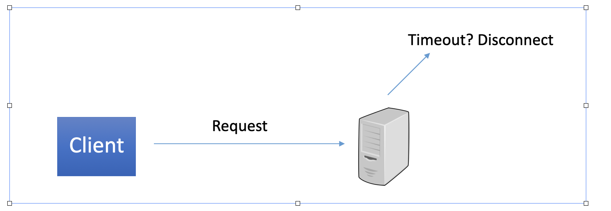
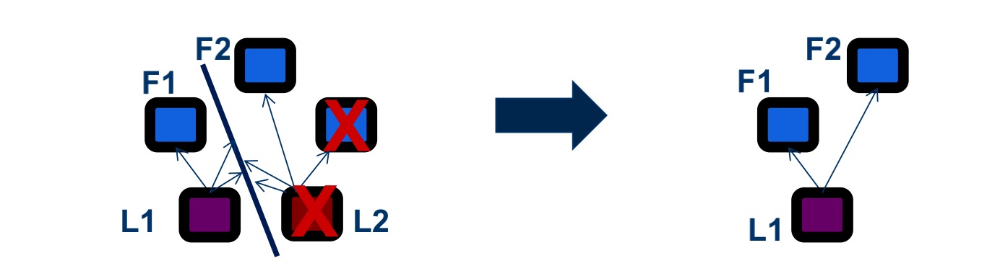

# 1 Need more Protection From DDoS


We have used `ThreadPool` to do the concurrency control, like to make sure how many threads are allowed during the lauch of application. But chances are good many bad requests are coming and we do not have a list to prevent this from happening.


```java
while(true) {

  Socket client = null;
  try {
    client = this.serverSocket.accept();
    System.out.println("Client accepted");

    threadPool.execute(new Worker(client, this.serverSocket));;
  } catch (Exception e){//whatever bad happens, we close and regard it as bad reqeust
    e.printStackTrace();
  }
}   
```


We read the request by first read the first line, which indicates how many bytes it has.

However, if the client does not send enough bytes, the socket will hang there

* In the future, we can fix this by adding a track timer. If the request has not been received within say 10 seconds, we will reject it




# 2 Improve Availability

Right now we only have one server being deployed. If this server is down due to physical errors, then we cannot provide the service.


Thus, we could have 3-5 servers coordinating using Paxos Protocol



* As a result, if we have 5 servers, we can withstand 2 failures and still function well


# 3 Encryption Action

Right now we have the XML format of request, like 

```xml
<?xml version="1.0" encoding="UTF-8"?>
<create>
	<account id="123456" balance="1000"/>
	<symbol sym="SPY">
		<account id="123458">100000</account>
		<account id="123459">100000</account>
	</symbol>
	<account id="123457" balance="1000"/>
</create>
```


But we could suffer from Man-In-The-Middle Attack where they can acquire what client has asked for.

We could improve on that by adding Encryption Action or Hashing.


# 4 User Permissions

Previously, we did not restrict users to only be able to query or cancel their own orders (since the requirement doc does not require us to do this check), which means as long as the given user id is valid, the user can query or cancel any order by giving a valid order id.

Now we have added this restriction, which means users can only query/cancel their own orders, and we will report an error if a user is trying to cancel/query someone else's orders.

However, in this project, we do not have any user authentication, and anyone can act as any user as long as it uses that user's account id. But in a real system, we will want to make sure there is a user authentication system and give every user appropriate permissions (only give it the permissions it needs).


# 5 Input Sanitization

We are using Hibernate to interact with the database, and some attacks, such as SQL injection attacks, should be able to be defended. However, if the user gives some special input (e.g., an extremely looong 10000-char symbol name), there will still be exceptions (because the symbol name field in the database table is a char array with length 255). 

These kinds of problems may not crash our program because we have many try-catch clauses to catch exceptions, but we have not addressed them gracefully (e.g., give informational error messages).


