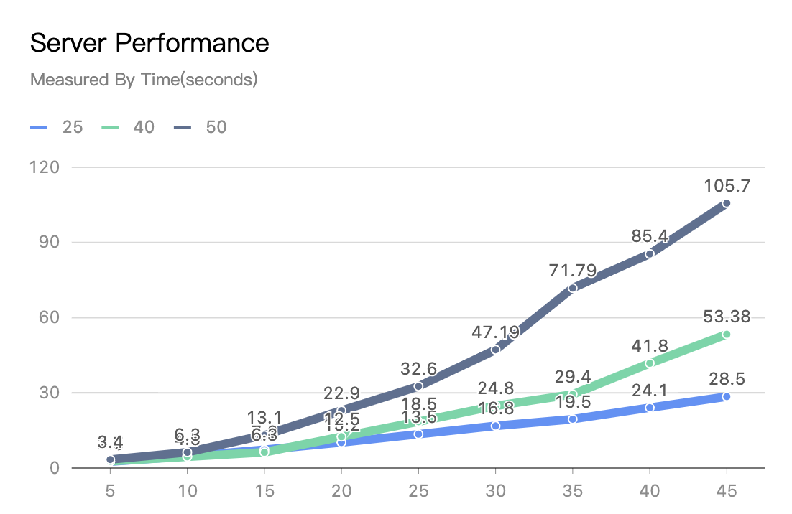
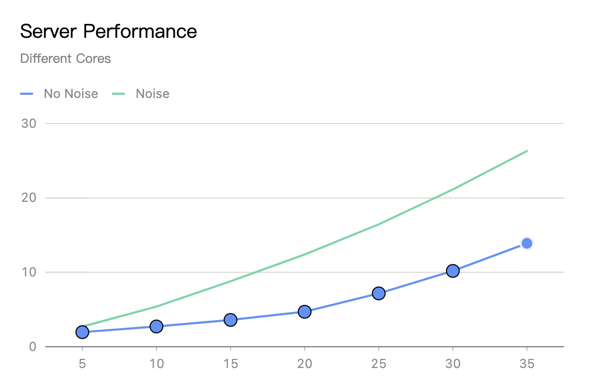
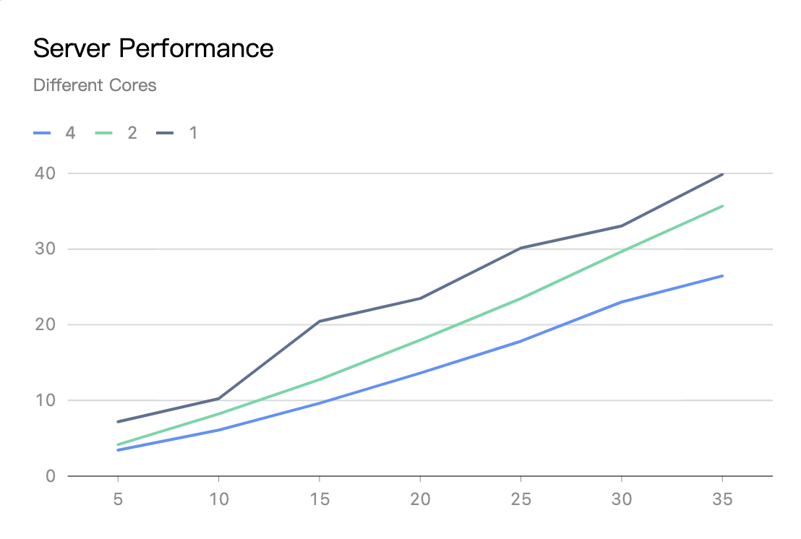
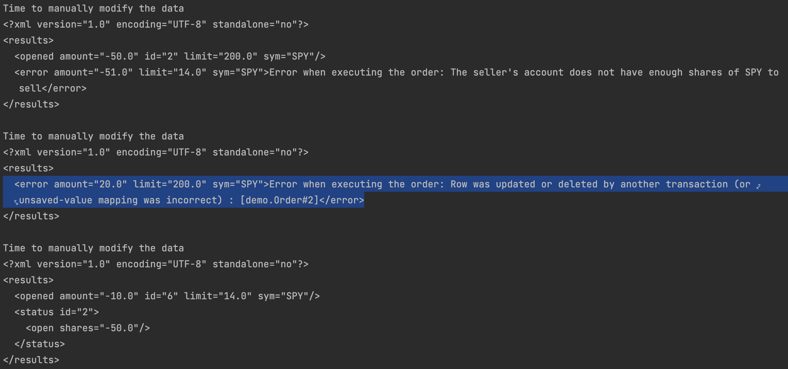

# 1 Introduction

This report is mainly about how to measure server performance, as well as analyse the scalability of the server.


# 2 Test Method


Test Script Location: `erss-hm4-xz295-wg83/src/test/java/demo/IntegrationTest.sh`

**Key Parameters: **

* `ACCOUNT_LEN`: indicate how long the account can be. This is used to test for correctness, preventing for duplicate generation of account numbers
* `WORK_LOAD`: indicate how many clients can send the command at the same time
* `REQUEST_NUM`: how many requests each client can send at one time


## 2.1 Workload Test

* In this section, we have set 25, 40, 50 messages in one client command
* And the x-axis is how many clients are concurrently send the request, which can measure how servers handle this under many clients.
* y-axis is how long it takes for server to finish the request





> **Result**

* We can see as the message increasing per request, the time for server to deal will increase
* When client number increases, for same request, it will take server sometimes 2 times to process.


## 2.2 Workload Test With Bad Request Noise

We can force once the service is online, there might be some clients sending bad request.

Thus we test under such nodes, if server lowers its performance


> **Method**

* We have launched a bad request thread, which every 0.5 seconds will issue 5X clients to send bad requests




> **Result**

* When being messes with the bad requests, the server has longer time to process that.
* In the future, we can add Proxy-Like protection. Once we find out some of clients who always send us the bad requests, we make it forbidden to visit the service


## 2.3 Different Cores Test

The basic setup is 

* under 4, 2, 1 cores, how server performs 
    * command `sudo taskset -p 0xf pid `
* the x-axis mean how many clients send the request concurrently
* the y-axis mean how long it takes for server to process that




> **Result**

* We can see as the number of cores increase, the time it spends will be shorter
* but it won't be twice, or four times shorter compared to one core.
    * the main reason could be contention increasing and it takes longer to acquire the lock


## 2.4 Database Concurrency Test

* We used Hibernate's optimistic concurrency control to solve the database concurrency problem.
* To make sure it works well, we tested it by manually changing the data in the database to simulate the case that multiple threads are changing the same data concurrently.
  * In our code, after reading the data from the database, and before writing the modified data back to the database, we added a sleep to allow us to have enough time to change the data manually.
    ```
    // In OrderTransaction.java
    List<Order> relatedOrders = getOpenOrdersWithSym(session, order.getSym());
    // We have got the orders from the database
    System.out.println("Time to manually modify the data");
    // Now it's time to manually change the data
    TimeUnit.SECONDS.sleep(3);
    // The data has been manually changed, the normal operation is continued (execute the order and write some modified data back to the database)
    ```
  * When the code is sleeping, we manually change the data in the database:
    ```
    postgres=# update orders set version = 5 where id = 2;
    UPDATE 1
    ```
* Here is the result
  
  The screenshot clearly shows that Hibernate can help us report an error when the data is modified in the middle of a transaction, and our program successfully reports the error and continue the execution to fulfill further user requests.


